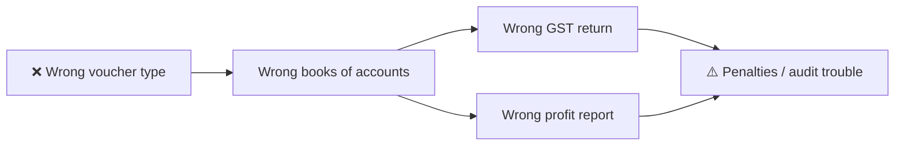
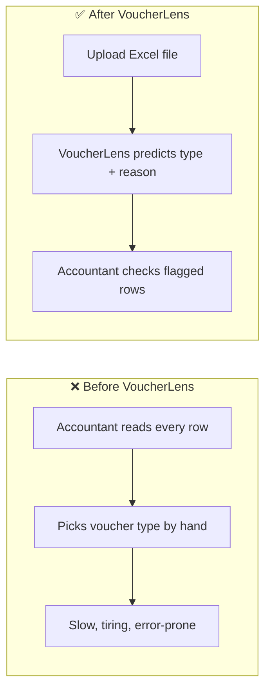
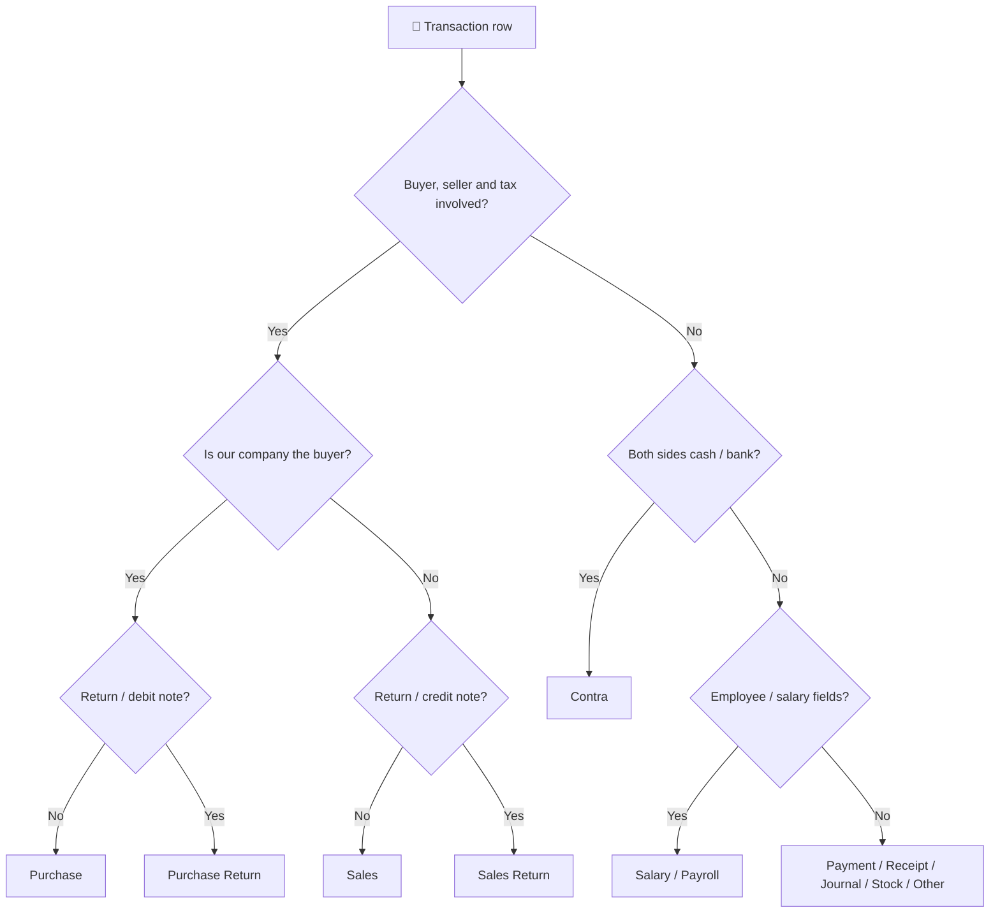
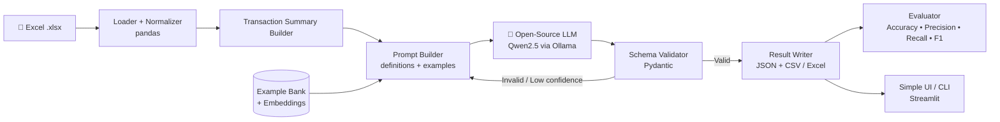
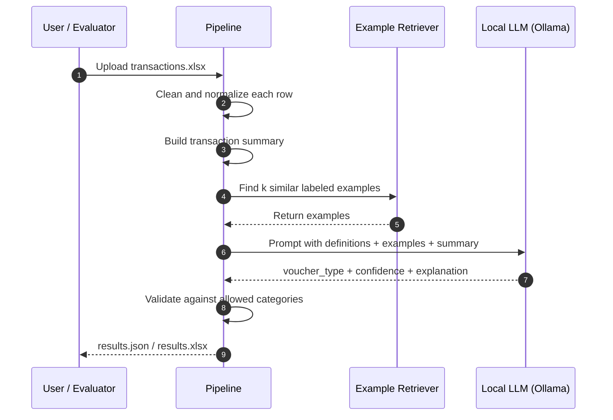
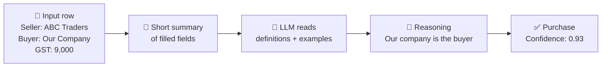

# 1. Project Name

**VoucherLens: Open-Source LLM Voucher Classifier for VYOM+**

> Hacktober Fest | Open Source AI Hackathon | Track 4: Intelligent Voucher Classification Using Open-Source LLMs
> Team: _<VoucherLens>_ | Members: _<1.Ashutosh gupta  2.Shivang singh   3.Bhagyesh Manwani   4.Om khakre>_


## 🚀 VoucherLens at a Glance


**Core idea:** VoucherLens uses an open-source, locally running LLM as the primary decision-maker for classifying structured transactions into the correct voucher category.

---

# 2. Problem Statement

**Every business transaction must be recorded under the correct accounting "voucher type" before the books can be trusted.** A wrongly typed entry (a Sales entry recorded as a Purchase, for example) flows into GST returns, profit reports and audits, and it is usually discovered only weeks later, when fixing it is slow and expensive.

Today, accountants choose the type manually for thousands of rows, or rely on keyword rules that break easily. The task is slow, repetitive and error-prone, and small businesses without a trained accountant suffer most.

Keyword rules fail because many voucher types look alike in the data:

- A **Purchase** and a **Sales** invoice have the same fields; only the direction (who is the seller and who is the buyer) differs.
- A **Purchase Return / Debit Note** and a **Sales Return / Credit Note** are mirror images of each other.
- A **Contra** entry (cash to bank) looks like a Payment or Receipt but is neither.
- **Stock Journal**, **Material In/Out** and **Delivery Note** move inventory without being a sale or purchase.
- **Import / Export** transactions look like Purchase / Sales but carry currency and cross-border fields.

**Why a wrong label is costly:**



Given an Excel sheet of structured transactions **with the voucher type column removed**, the system must predict the correct voucher type for each row by reasoning over **all fields together**, not a single keyword.

---

# 3. Project Overview

VoucherLens reads an Excel file of transactions, converts each row into a clean, compact "transaction summary", and asks a **locally running open-source LLM** to choose exactly one of the 27 voucher categories. The LLM's output is forced into a strict JSON format, validated, and written to a result file along with a confidence score and a short explanation.

It is designed as the bridge between **invoice extraction** (reading documents) and **automated voucher creation** (posting entries) in the VYOM+ workflow.

---

# 4. Proposed Solution

A hybrid pipeline where the **open-source LLM is the primary classifier**, supported by light, transparent preprocessing:

1. **Ingest** the Excel file with pandas.
2. **Normalize** column names and values (dates, numbers, blanks).
3. **Build a transaction summary** per row: only non-empty fields, plus a few computed hints (for example "GST present", "currency is not INR", "has payroll fields").
4. **Prompt** the LLM with the category definitions, a few worked examples, and the transaction summary.
5. **Constrain the output** to a JSON schema so the model can only return a valid category.
6. **Validate and retry** if the output is malformed or the confidence is low.
7. **Export** JSON and Excel/CSV results, and **evaluate** with a reproducible script.

---

# 5. Objectives

- Predict one valid voucher category for every transaction row.
- Distinguish semantically similar categories (Purchase vs Sales, returns, Contra vs Payment/Receipt, Journal, inventory movements, Import/Export).
- Use an open-source / openly available LLM as the main intelligence layer, with **no proprietary API**.
- Handle missing, incomplete or ambiguous rows gracefully (fall back to "Other / Miscellaneous" or flag for review).
- Produce machine-readable output that can be scored programmatically.
- Provide a reproducible evaluation method (accuracy, precision, recall, F1, per-category report).
- Keep inference fast and light enough to run on a laptop or a free GPU notebook.

---

# 6. Target Users / Use Case

| User | How they use VoucherLens |
|---|---|
| Accountants / bookkeepers | Upload a sheet of unlabeled transactions and get suggested voucher types to review |
| VYOM+ platform | Plug the classifier in after invoice extraction to automate voucher creation |
| Small and medium businesses | Reduce manual tagging effort and entry errors |
| Hackathon evaluators | Run the pipeline on a hidden Excel dataset and score the output file |

**Primary use case:** a batch of structured transaction rows goes in, and one voucher category per row comes out.

**Before and after VoucherLens:**



---

# 7. Open-Source AI Technology Selected

| Component | Choice | Licence type |
|---|---|---|
| Primary classifier (LLM / SLM) | **Qwen2.5-7B-Instruct** (quantized, 4-bit); **Gemma** as an alternative to compare | Open weights |
| Local inference runtime | **Ollama** (built on llama.cpp) | Open source |
| Embedding model (for example-retrieval) | **BGE-small** or **all-MiniLM** via `sentence-transformers` | Open source |
| Data and evaluation | **pandas**, **openpyxl**, **scikit-learn** | Open source |
| Output validation | **Pydantic** (JSON schema) | Open source |

> The exact model size will be chosen to fit the hardware available on the day (a smaller model such as a 3B to 4B variant is the fallback).

---

# 8. Why This Technology Was Selected

- **Reasoning over many fields:** an instruction-tuned LLM can combine seller, buyer, tax, payment and inventory cues the way an accountant would, which keyword rules cannot.
- **Open and local:** weights can be downloaded and run offline. Financial data stays on the machine, which matters for accounting data, and no per-call API cost applies.
- **Quantization:** 4-bit models run on a modest laptop or a free GPU notebook.
- **Structured output:** Ollama supports JSON-schema-constrained generation, so the model can only output a valid category.
- **Flexible:** the same pipeline can swap in Gemma, Llama, Mistral or Phi to compare results.
- **Open-source approach suits the project** because the task is reproducible, auditable and can be improved by the community and by VYOM+ over time.

---

# 9. AI's Role in the System

The LLM is **the core decision-maker**. It receives the full transaction context plus category definitions and:

1. Decides the transaction's **direction** (we are buying vs selling).
2. Recognizes **special cases** (return, advance, payroll, stock movement, import/export, contra).
3. Chooses **one voucher type**.
4. Returns a **confidence score** and a **short explanation**.

Non-AI code only prepares the data, builds the prompt, validates the output and computes metrics. It never replaces the model's decision.

**How the model reasons (simplified view; the LLM handles all 27 categories):**



---

# 10. System Architecture



---

# 11. Component-Level Architecture

| # | Component | Responsibility | Input | Output |
|---|---|---|---|---|
| 1 | **Loader** | Read the Excel file, strip whitespace, standardize column names | `.xlsx` | DataFrame |
| 2 | **Normalizer** | Parse dates and numbers, mark blanks, detect currency | DataFrame | Clean DataFrame |
| 3 | **Summary Builder** | Turn each row into compact text listing only non-empty fields and simple hints | Row | Transaction summary text |
| 4 | **Example Bank** | Small set of hand-written example transactions per category, embedded for retrieval | Text examples | Vector index |
| 5 | **Prompt Builder** | Combine instructions, 27 category definitions, top-k similar examples and the summary | Summary and examples | Prompt |
| 6 | **LLM Engine** | Run the quantized model locally with JSON-schema-constrained output | Prompt | JSON prediction |
| 7 | **Validator** | Check that the category is in the allowed list; retry if invalid or low confidence | JSON | Validated prediction |
| 8 | **Writer** | Save the final results file | Predictions | `.json` and `.xlsx` / `.csv` |
| 9 | **Evaluator** | Compare predictions with ground truth where available | Predictions and labels | Metrics report |
| 10 | **UI / CLI** | Upload a file and view predictions | User action | Results table |

---

# 12. Data / Information Flow



**One row, step by step:**



**Input row (example, conceptual):**
`seller: ABC Traders | buyer: Our Company | taxable value: 50,000 | GST: 9,000 | item: raw material | invoice no: INV-2026-1042`

**Output (minimum):**

```json
{ "invoice_number": "INV-2026-1042", "voucher_type": "Purchase" }
```

**Output (extended):**

```json
{
  "invoice_number": "INV-2026-1042",
  "voucher_type": "Purchase",
  "confidence": 0.91,
  "explanation": "Our company is the buyer; goods with GST were received from the supplier."
}
```

---

# 13. Agentic Workflow (if applicable)

The core system is a **single-model classification pipeline**, not a multi-agent system. A light **self-check loop** is included:

1. The LLM makes a first prediction with a confidence score.
2. If the output is invalid, or confidence is below a threshold, the pipeline **retries** once with extra context (more retrieved examples and a note about the likely confusing categories, for example "decide between Purchase and Purchase Return").
3. If it is still uncertain, the row is labeled **Other / Miscellaneous** and flagged `needs_review = true`.

---

# 14. Technology Stack

| Layer | Tools |
|---|---|
| Language | Python 3.10+ |
| Data handling | pandas, openpyxl |
| LLM runtime | Ollama (llama.cpp backend), quantized open-weight model |
| Models | Qwen2.5-7B-Instruct (primary), Gemma (comparison) |
| Embeddings and retrieval | sentence-transformers (BGE-small / MiniLM), simple cosine similarity |
| Output validation | Pydantic, JSON schema |
| Evaluation | scikit-learn (classification report, confusion matrix) |
| Interface | Streamlit (upload and results table) and a command-line script |
| Version control | Git and GitHub, with an open-source licence |

---

# 15. Expected Features

- Upload an Excel file and classify every row.
- Support all **27 voucher categories** listed in the problem statement.
- One category per row, in JSON and tabular output.
- Confidence score and short explanation per row.
- Graceful handling of missing columns and blank values.
- Flagging of ambiguous rows for human review.
- Per-category evaluation report and confusion matrix.
- Reproducible evaluation script plus a fixed random seed and fixed prompt template.
- Simple UI and CLI.

---

# 16. Implementation Approach

Planned for the one-day final, in priority order:

1. **Setup (first):** install Ollama, pull the model, and confirm a test prompt returns valid JSON.
2. **Data layer:** load the provided Excel file, inspect columns, write the normalizer and summary builder.
3. **Core classifier:** write the prompt (category definitions and decision rules) and enforce JSON-schema output. Get a working end-to-end run on a few rows.
4. **Example bank:** write a small set of hand-made examples per category, especially the confusing pairs. Add retrieval of the most similar examples.
5. **Validation and retry:** add the confidence threshold and the fallback to Other / Miscellaneous.
6. **Evaluation:** create a small labeled test set (hand-labeled from the data and synthetic examples), compute accuracy, precision, recall and F1, then tune the prompt using the results.
7. **Interface and polish:** Streamlit upload page, results export, README for running it.
8. **Stretch goals (only if time allows):** compare Gemma against Qwen, or try LoRA fine-tuning if labeled data becomes available.

**Decision rules written into the prompt (examples):**

- If our company is the buyer and goods or services were received with tax, then Purchase. If we are the seller, then Sales.
- If a debit or credit note or return reference is present, then Purchase Return or Sales Return, chosen by direction.
- If both sides of the entry are cash or bank accounts, then Contra.
- If employee, salary or payroll fields are present, then Salary / Payroll.
- If stock moves with no sale or purchase value, then Stock Journal, Material In/Out, or Delivery / Receipt Note.
- If foreign currency or import/export details are present, then Import or Export.

---

# 17. Expected Final Output

1. A working classifier that takes an `.xlsx` of transactions and returns one voucher type per row.
2. **`results.json`** and **`results.xlsx` / `.csv`** with `invoice_number`, `voucher_type`, `confidence`, `explanation`, `needs_review`.
3. An **evaluation report**: overall accuracy, macro and weighted precision, recall and F1, per-category scores, and a confusion matrix.
4. A simple **Streamlit UI** and a **CLI command** to run the pipeline.
5. A public GitHub repository with the code, run instructions and an open-source licence.

---

# 18. Future Scope / Scalability

- **Fine-tune** a small model with LoRA/QLoRA on real labeled VYOM+ data for higher accuracy and faster inference.
- **Batch and parallel inference** for large files, with caching of repeated patterns.
- **Hybrid routing:** use cheap rules for very obvious rows, and the LLM for ambiguous ones, to cut compute.
- **Pipeline integration:** connect directly to the VYOM+ invoice-extraction output and auto-create vouchers.
- **Feedback loop:** let accountants correct predictions, and reuse those corrections as new examples.
- **More models:** swap in other open models without changing the pipeline.
- **API service:** wrap the classifier as a REST endpoint for other systems.

---

# 19. Open-Source Dependencies / Components

| Component | Purpose |
|---|---|
| Qwen2.5-7B-Instruct (open weights) | Primary voucher classification |
| Gemma (open weights) | Alternative model for comparison |
| Ollama / llama.cpp | Local, quantized model inference |
| sentence-transformers (BGE-small / MiniLM) | Embeddings for similar-example retrieval |
| pandas, openpyxl | Reading and cleaning Excel data |
| Pydantic | JSON schema and output validation |
| scikit-learn | Metrics and confusion matrix |
| Streamlit | Simple upload and results interface |

All components are open source or openly licensed. **No proprietary API is used for classification.**

---

# 20. Expected Challenges and Mitigation

| Challenge | Why it matters | Mitigation |
|---|---|---|
| **No labels in the provided data** | The voucher column is intentionally missing, so supervised training is limited | Rely on prompt-based reasoning with clear definitions and hand-written examples; build a small hand-labeled test set; treat fine-tuning as a stretch goal |
| **Confusing category pairs** | Purchase vs Sales and return types share the same fields | Explicit decision rules in the prompt, a direction hint in the summary, and targeted examples for each pair |
| **Missing or messy fields** | Real data has blanks and inconsistent columns | Normalizer, summaries that skip empty fields, and a fallback to Other / Miscellaneous with a review flag |
| **LLM invalid or off-list output** | Free text breaks programmatic evaluation | JSON-schema-constrained decoding, Pydantic validation, and one retry |
| **Inference speed on limited hardware** | Many rows with a 7B model can be slow | 4-bit quantization, short prompts, batching, a smaller fallback model, and caching |

---
